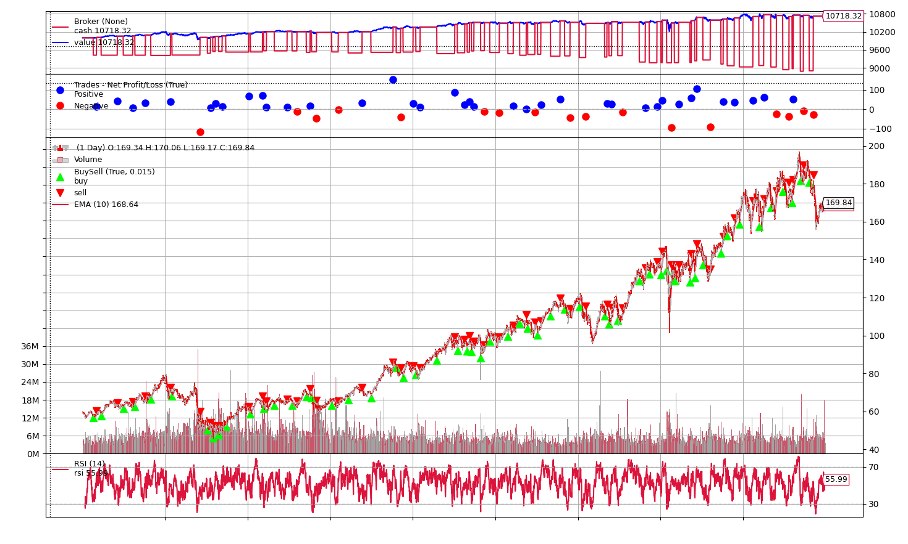

# Transformer-Powered Trading Simulator

A powerful **backtesting framework** built on [Backtrader](https://www.backtrader.com/) that integrates a **custom Transformer model** for time series forecasting. This project demonstrates how deep learning — specifically a **Transformer trained on market features** — can be used to guide trading decisions in a systematic, backtestable way.

---

## Project Focus

This project is **centered around a Transformer neural network** that I have created and trained on multivariate financial time series data (price + technical indicators). It uses the model's **future price prediction** to influence live trading decisions within a backtesting simulation.

---

## Strategy: `RsiEmaStrategy`

This strategy is a **hybrid of deep learning and technical analysis**:

- Uses RSI + EMA for signal confirmation
- The core decision logic is driven by my **Transformer model** trained to predict the `close` price based on a feature-rich window of past data
- Trades are only triggered when both the **Transformer prediction** and traditional indicators align

### Input Features to Transformer:
- `close`
- `volume_zscore`, `rsi`, `macd`, `overnight_gap`, `return_lag_1`, `return_lag_3`, `return_lag_5`, `volatility`

### Trigger Logic:

```python
If RSI < 40 and Predicted Close > Current Price * 1.005 → BUY
If RSI > 60 and Predicted Close < Current Price * 0.995 → SELL
```

## Transformer Model Details

### Architecture: Encoder-decoder Transformer

### Trained with:

seq_len = 30
label_len = 10
pred_len = 5
Loss Function: MSE
Framework: PyTorch
Uses multivariate inputs and predicts future close prices
Scaling handled via scaler.pkl

### Analyzer: StrategyEvaluator

### Calculates:

- Sharpe Ratio
- Max Drawdown
- Win Rate
- Profit Factor
- Avg Risk/Reward
- Total Return

### === Performance Metrics ===

- Sharpe Ratio: -0.81
- Max Drawdown: 3.63%
- Win Rate: 69.09%
- Profit Factor: 2.11
- Avg Risk/Reward: 0.94:1
- Total Return: 7.18%



Note: Despite a high win rate and positive profit factor, the Sharpe Ratio is negative — suggesting volatility or return inconsistency.Further tuning or trade sizing logic is being worked on.


